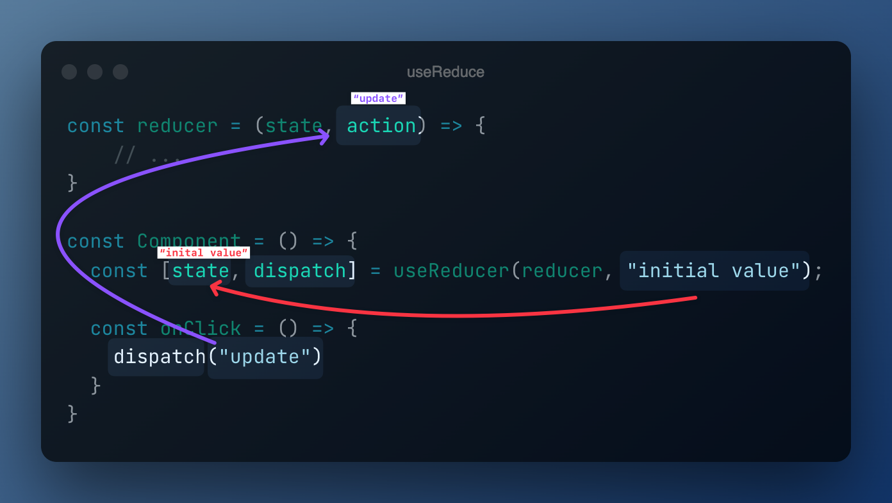

Voici un hook sous-côté mais moi même je ne l'utilises **jamais**. Cependnat je suis un peu obligé de te le présenter 🤔

Dans cet exercice, on va utiliser **toute la puissance**. Il faut savoir que quand
j'ai appris React c'est celui qui m'a posé le plus problème. Je vais essayer
de rendre son concept le plus simple possible.

[📖 Doc de useReducer](https://react.dev/reference/react/useReducer)



_J'explique ce flow dans la vidéo d'intro._

> C'est quoi la différence avec useState ?

`useState` est une version limitée de `useReducer`, regarde :

(En acceptant que `initialValue` ne soit pas une fonction)

```js
const reducer = (prevValue, newValue) => {
  // On peut aussi passer une fonction dans le `setState`
  if (typeof newValue === "function") {
    return newValue(prevValue);
  }
  return newValue;
};

const useState = (initialValue) => {
  const [state, setState] = React.useReducer(reducer, initialValue);
  return [state, setState];
};
```

Finalement, ce reduce est une sorte de `super useState` pour
réaliser tous tes rêves et tes désirs.

À vrai dire, `useState` est simplement une configuration par défaut de `useReducer`.

[📖 React hooks system](https://the-guild.dev/blog/react-hooks-system)

## Exercice 1 - Counter

Nous avons un counter qui ne fonctionne pas pour l'instant, fais
le fonctionner.
Quand tu cliques sur le compteur, il doit s'incrémenter de 1.

## Exercice 2 - Bouton moins !

Maintenant ajoute un deuxième button : le button moins !

Quand tu cliques dessus, il doit décrémenter de 1.

🦁 Tu vas devoir modifier la fonction `reducer` pour qu'elle
s'adapte à l'action qui est passée en paramètre.

💡 Tips de code :

```js
switch (action.type) {
  case "INCREMENT":
  // ...
  case "DECREMENT":
  // ...
  case "RESET";
  // ...
  default:
  // ...
}
```

Notre méthode va prendre en paramètre une `action` qui sera un object un peu comme ça :

```json
{
  "type": "INCREMENT"
}
```

En fonction de ce type, on vas retoruner une nouvelle valeur.

Tu vas donc pouvoir rajouter 2 buttons :

- `-` qui décrémente de 1
- `RESET` qui reset le compteur à 0

## Exercice 3 - Refactor et reset

Pour cet exercise, 3 choses :

1. Crée une constante qui contient chaque Action (`increment`, `decrement`, `reset`)
   et utilise ces constantes au lieu de string
2. Rajoute un bouton "+5" qui incrémente de 5 et un bouton "-5" qui décrémente de 5

💡 Tips de code :

```js
const REDUCER_ACTIONS = {
  INCREMENT: "INCREMENT",
  // ...
};
```

Pour le `+5` on va rajouter une nouvelle information dans `action` :

```json
{
  "type": "INCREMENT",
  "value": 5
}
```

Si il n'y a pas de `value`, on incrémente de 1.

Comme ça on évite de créer une nouvelle action pour chaque cas.

## Exercice 4 - Set value

on va venir remplacer le titre par un Input :

```jsx
<label className="input input-bordered flex  items-center gap-2">
  <Hash scale={16} />
  <input
    type="text"
    className="w-10 grow"
    placeholder="Count"
    value={count}
    onChange={(e) => {
      let value = parseInt(e.target.value);
      if (isNaN(value)) {
        value = 0;
      }
      // TODO...
    }}
  />
</label>
```

Cette `input` va nous permettre de changer la valeur du compteur.

Il va falloir rajouter une action `SET` qui va prendre en paramètre une valeur :

```json
{
  "type": "SET",
  "value": 5
}
```

À toi de jouer !

## Conclusion

Dans cette exercice on a appris à utiliser `useReducer` pour gérer un état plus complexe.

Ce hooks est en réalité très rarement utilisé dans la vie de tous les jours.... Mais il est bon de le connaître.
